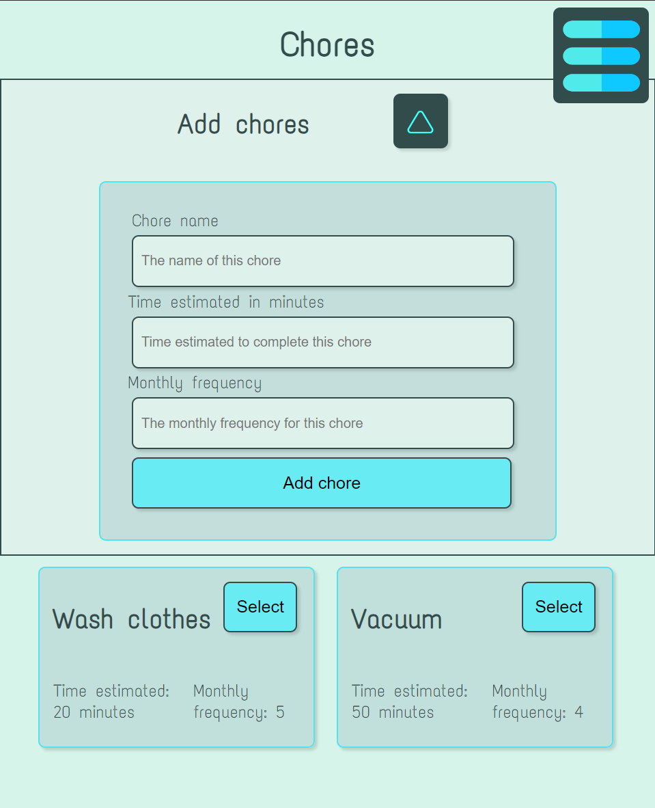

# Split

## Url

https://thesplit.netlify.app/

## Project idea

The idea is an app that gives the users an overview of the distribution of chores in their household

## Tech stack

-  Nuxt
-  Supabase
-  Sass
-  Chart.js

## Setup

Install dependencies:

```bash
# npm
npm install

```

## Development Server

Start the development server on `http://localhost:3000`:

```bash
# npm
npm run dev

```

## Screenshots

### Mobile


### Tablet





### Desktop


